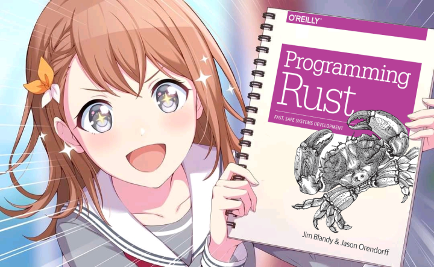

<div align="center">

  # 🦀 aghpb.rs 📚
  <sub>Rust API wrapper for the anime girls holding programming books [API](https://api.devgoldy.xyz/aghpb/v1/docs)</sub>

  [](https://crates.io/crates/aghpb)
  [](https://docs.rs/aghpb)

</div>

<div align="center">

  

</div>

<br>

> #### BTW, my first ever rust library.

## Install
```rust
cargo add aghpb
```
More install instructions at [crates.io](https://crates.io/crates/aghpb).

## Examples
This is how you may retrieve a random anime girls holding programming books:
```rust
use std::error::Error;

#[tokio::main]
async fn main() -> Result<(), Box<dyn Error>> {
    let book = aghpb::random(None).await?;

    println!("Name: {}", book.name);
    println!("Category: {}", book.category);

    book.image.save("./anime_girl.png")?;

    Ok(())
}
```
You can also retrieve specific categories of anime girls holding programming books like so:
```rust
let book = aghpb::random(Some("rust")).await?;
```

<br>

This is how you may retrieve a list of available categories:
```rust
use std::error::Error;

#[tokio::main]
async fn main() -> Result<(), Box<dyn Error>> {
    let categories = aghpb::categories().await?;

    for category in categories {
        println!("{}", category);
    }

    Ok(())
}
```

Made using my API at 👉 https://api.devgoldy.xyz/aghpb/v1/
